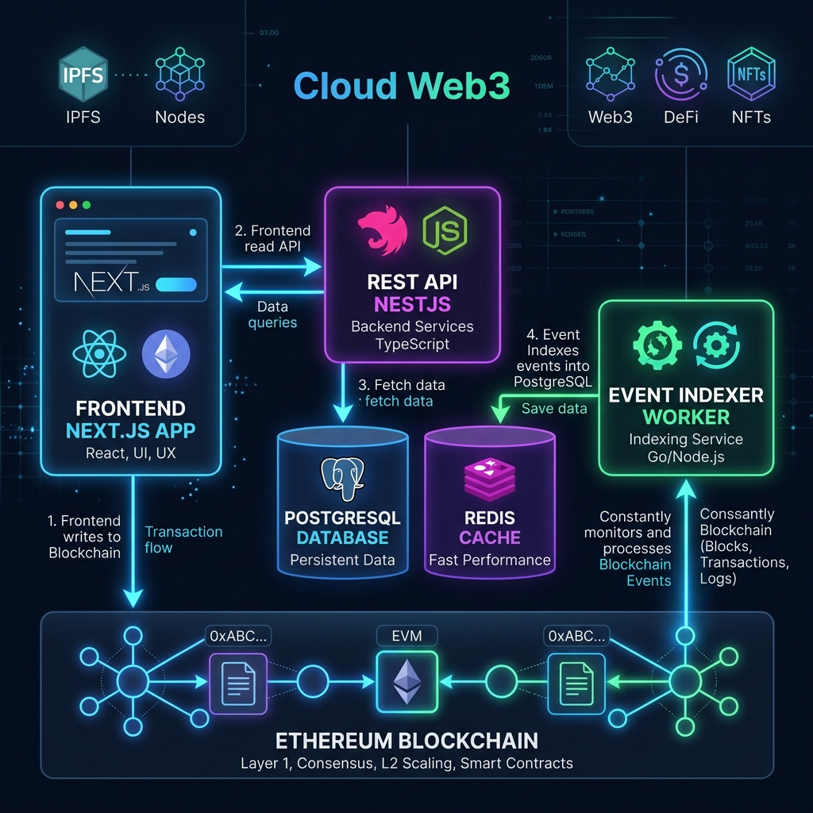

# BlockForge — Cloud-Native NFT Marketplace

> **Alternate BlockForge implementation.** The featured portfolio project is [BlockForgeNFT](https://github.com/404priyanshu/BlockForgeNFT). This variant explores a separate polling worker, cursor-based indexing, and Redis coordination; its setup and architecture apply to this repository.

A full-stack, cloud-native NFT marketplace demonstrating production-grade architecture with smart contracts as the source of truth, an event-driven blockchain indexer, a RESTful API, and a modern React frontend.


## Architecture Overview



**Key design principle:** The blockchain is the source of truth. The database is a read-optimized index rebuilt by an idempotent event indexer. The frontend reads from the API and writes directly to the blockchain via wallet transactions.

## System Design

### Event-Driven CQRS Pattern
- **Write path:** Users sign transactions → wallet sends to blockchain → smart contract emits events
- **Read path:** Worker polls chain → indexes events to Postgres → API serves indexed data → frontend displays it
- **Separation:** Backend never holds private keys. All state mutations go through on-chain transactions.

### Idempotent Indexing
- All database writes use upserts with unique constraints (`chainId + txHash + logIndex`)
- Worker uses a Redis distributed lock to prevent concurrent indexing
- Cursor-based block scanning with configurable range (default 1000 blocks)
- Safe to restart at any time — will re-process from last saved cursor

### Wallet Authentication
- No passwords — authentication uses Ethereum signature verification
- Flow: request nonce → sign with wallet → verify signature → issue JWT
- Nonces stored in Redis with TTL (single-use, expires in 5 minutes)

## Quick Start

```bash
# 1. Install dependencies
pnpm install

# 2. Start infrastructure (Postgres + Redis)
pnpm infra:up

# 3. Copy environment files
cp .env.example .env
cp apps/api/.env.example apps/api/.env
cp packages/database/.env.example packages/database/.env

# 4. Run migrations and start API
pnpm db:migrate
pnpm dev:api
```

API is at `http://localhost:3001/health` and Swagger docs at `http://localhost:3001/docs`.

### Full Demo (contracts + indexer + frontend)

```bash
# Run the automated demo script
bash scripts/demo-local.sh
```

Or manually:

```bash
# Terminal 1: Hardhat node
pnpm contracts:node

# Terminal 2: Deploy + seed
pnpm contracts:deploy
# Copy contract addresses to .env and apps/worker/.env
pnpm contracts:seed-local

# Terminal 3: Worker
pnpm dev:worker

# Terminal 4: Frontend
pnpm dev:web
```

## Project Structure

```
cloud-native-nft-marketplace/
├── apps/
│   ├── api/              # NestJS REST API (port 3001)
│   ├── web/              # Next.js frontend (port 3000)
│   └── worker/           # Blockchain event indexer
├── packages/
│   ├── contracts/        # Solidity smart contracts (Hardhat 3)
│   ├── database/         # Prisma schema + migrations
│   └── shared/           # ABIs, types, config
├── infra/
│   └── terraform/        # AWS infrastructure (ECS, RDS, ElastiCache)
├── scripts/
│   └── demo-local.sh     # Automated local demo
├── docs/
│   └── local-dev.md      # Development guide
├── Dockerfile            # Multi-stage Docker build
├── docker-compose.yml    # Local services (Postgres, Redis, API, Worker)
└── .github/workflows/    # CI/CD pipeline
```

## Smart Contracts

| Contract | Description |
|---|---|
| `BlockForgeNFT` | ERC-721 with URI storage. Public `mintNFT(tokenURI)` with auto-incrementing IDs. |
| `BlockForgeMarketplace` | Fixed-price marketplace with escrow. List, buy, cancel NFTs. 2.5% platform fee. ReentrancyGuard protected. |

## API Endpoints

| Method | Route | Description |
|---|---|---|
| GET | `/health` | Service health check |
| POST | `/auth/nonce` | Request wallet sign-in nonce |
| POST | `/auth/verify` | Verify signature, receive JWT |
| GET | `/nfts` | List indexed NFTs |
| GET | `/nfts/:id` | Get NFT by ID |
| GET | `/listings` | List marketplace listings (`?status=ACTIVE\|SOLD\|CANCELLED`) |
| GET | `/listings/:id` | Get listing by ID |
| GET | `/transactions` | List indexed blockchain events |
| GET | `/users/:wallet` | Get user profile |
| GET | `/users/:wallet/nfts` | Get user's NFTs |
| GET | `/users/:wallet/listings` | Get user's listings |
| POST | `/upload/presigned-url` | Get S3 presigned upload URL |

## Tech Stack

| Layer | Technology |
|---|---|
| Smart Contracts | Solidity 0.8.28, OpenZeppelin, Hardhat 3 |
| API | NestJS 11, TypeScript, Prisma, JWT |
| Worker | TypeScript, viem, ioredis |
| Frontend | Next.js 16, React 19, Tailwind CSS 4, RainbowKit, wagmi |
| Database | PostgreSQL 17, Prisma ORM |
| Cache | Redis 7 |
| Infrastructure | Docker, Terraform (AWS ECS Fargate) |
| CI/CD | GitHub Actions |

## Commands Reference

| Command | Description |
|---|---|
| `pnpm infra:up` | Start Postgres + Redis |
| `pnpm infra:down` | Stop infrastructure |
| `pnpm dev:api` | Start API in dev mode |
| `pnpm dev:worker` | Start worker in dev mode |
| `pnpm dev:web` | Start frontend in dev mode |
| `pnpm db:migrate` | Run database migrations |
| `pnpm db:studio` | Open Prisma Studio |
| `pnpm contracts:node` | Start local Hardhat node |
| `pnpm contracts:deploy` | Deploy contracts to localhost |
| `pnpm contracts:seed-local` | Seed test events |
| `pnpm contracts:test` | Run Solidity tests |

## Verification

```bash
# Health check
curl http://localhost:3001/health

# View indexed data
curl http://localhost:3001/nfts
curl http://localhost:3001/listings?status=ACTIVE
curl http://localhost:3001/transactions
```

## Known Limitations / Future Work

- **IPFS/Arweave:** Currently uses S3 for NFT assets. Could be replaced with decentralized storage.
- **Event reorgs:** No chain reorganization detection. Production would need finality confirmation.
- **Real-time updates:** API is poll-based. WebSocket support would improve UX.
- **Multi-chain:** Currently single-chain. Architecture supports multi-chain via `chainId`.
- **Auction listings:** Only fixed-price listings. Could add English/Dutch auctions.
- **Production monitoring:** Needs Datadog/Grafana integration for observability.
- **Frontend optimizations:** SSR for SEO pages, image optimization pipeline, PWA support.

## License

MIT
